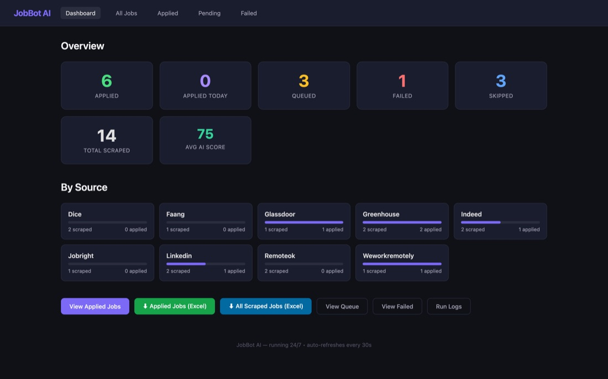
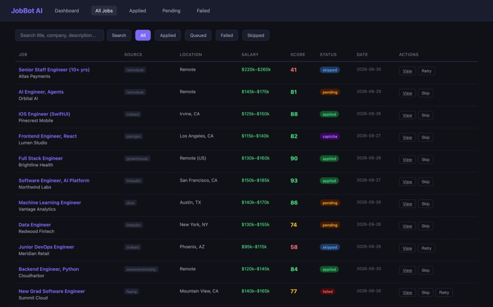

<div align="center">

# 🤖 JobBot AI

**A 24/7 job-hunting bot. It scrapes nine job boards, scores every listing against your resume with Claude, applies to the good ones, and reports it all on a live dashboard.**




</div>

---

## Why

Good roles get hundreds of applicants in the first day. JobBot keeps watch while you sleep: every few hours it sweeps the boards, throws out what doesn't fit, and gets your application in early on what does.

## How it works

```
 every 3 hours (APScheduler)
 ┌─────────────┐   ┌──────────────┐   ┌──────────────────┐   ┌──────────────┐
 │  9 scrapers │ → │ Claude score │ → │ Playwright apply │ → │ SQLite + XLSX│
 │  boards+ATS │   │ 0–100 + why  │   │ forms + cover    │   │ dashboard    │
 └─────────────┘   └──────────────┘   │ letters          │   └──────────────┘
                                      └──────────────────┘
```

1. **Scrape.** Dedicated scrapers for **LinkedIn, Indeed, Glassdoor, Dice, Greenhouse boards, JobRight, RemoteOK, We Work Remotely** and big-tech career sites. Duplicates are removed by URL.
2. **Score.** Claude reads each description against your resume and returns a 0–100 fit score with reasoning. Exclude-keyword rules skip roles you'd never take.
3. **Apply.** A stealth Playwright browser reuses saved logins, fills forms (with AI help for tricky questions), writes a tailored cover letter, and takes a screenshot as proof.
4. **Handle failure.** CAPTCHAs are detected and parked for manual follow-up, and failed attempts are retried a limited number of times.
5. **Report.** Everything lands in SQLite, a live dashboard, and auto-exported Excel sheets (`applied_jobs.xlsx`, `all_scraped_jobs.xlsx`).

## Dashboard



- **Overview:** applied, applied today, queued, failed, skipped, total scraped and average AI score.
- **By source:** scraped vs. applied for every board.
- **All jobs:** search plus filters for Applied, Queued, Failed and Skipped, with salary, AI score, status, and per-job **View / Skip / Retry**.
- **One-click Excel export** of applied or all scraped jobs.

<sub>Screenshots use a demo database of fictional companies.</sub>

## Quick start

```sh
./setup.sh                                  # venv, dependencies, Playwright browser
cp config.example.yaml config.yaml          # your profile, resume text, targets, exclusions
cp .env.example .env                        # ANTHROPIC_API_KEY

python main.py                              # one full run
python scheduler.py                         # keep running on an interval (default 3h)
uvicorn dashboard.app:app --port 8080       # dashboard → http://127.0.0.1:8080
```

`config.yaml`, cookies, logs, screenshots, the database and the Excel exports are all git-ignored, so your personal data stays on your machine.

## Project layout

```
scrapers/     one module per board (linkedin, indeed, glassdoor, dice, greenhouse, jobright, remoteok, weworkremotely, faang)
ai/           matcher.py: Claude scoring, cover letters, form-answer help
automation/   browser.py (stealth Playwright), login_manager.py, form_filler.py
database/     db.py (aiosqlite), export.py (openpyxl)
dashboard/    FastAPI + Jinja2 UI
main.py       one pipeline run · scheduler.py  recurring runs
```

## About

Built by **Roszhan Raj**. Use responsibly and respect each site's terms of service.
